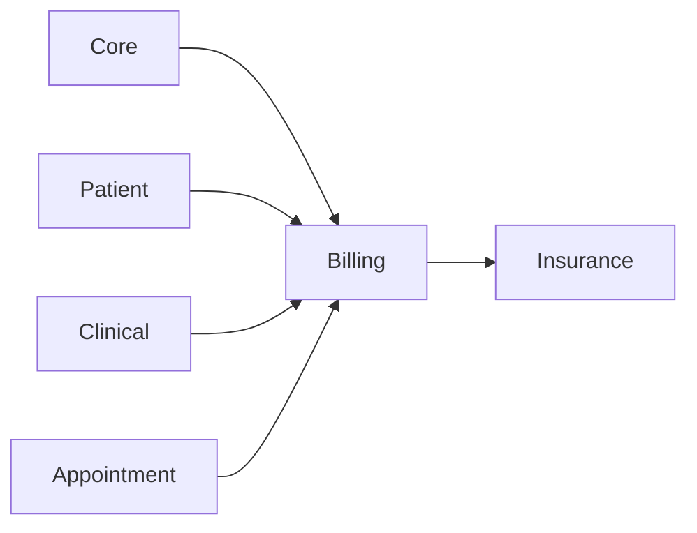

# Billing module

**In one sentence:** Billing turns care activities into invoices, tracks payments, and manages gateway/webhook flows so facilities know what is owed, paid, and still outstanding.

## Why this module exists

Clinical documentation alone does not close a patient journey. Facilities also need:

- invoice creation and issuance,
- line-level charge tracking,
- payment capture and allocation,
- unpaid reminders and reconciliation.

This module contains those financial workflows.

## Where Billing fits in FlowRise

- Uses **Core** context (branches, permissions, shared infrastructure).
- Uses **Patient** context for balances and patient-facing notifications.
- Syncs with **Clinical/Appointment** generated work through event/listener patterns and related billing line updates.
- Is a dependency target for **Insurance** claim orchestration.



## What you can do with it

- Create and issue invoices with detailed invoice lines.
- Record and allocate payments (full or partial).
- Record patient **deposits** (prepaid credit) and **apply** them to issued invoices.
- Create **payment plans** (installment schedules) on issued invoices and collect installments.
- Generate receipts, invoice PDFs, and revenue exports.
- Manage per-branch payment gateway settings.
- Process payment webhooks and checkout session flows.
- Trigger reminders/notifications for unpaid bills (scheduled overdue check with cooldown).

## How it works (simple)

1. Chargeable activity is added as invoice lines (manually or through sync listeners).
2. Totals and status are computed through billing services.
3. Payment intents and gateway flows confirm payment events.
4. Allocations update invoice balance and paid/partially-paid state.
5. Notifications, reports, and downstream modules (like Insurance) consume billing outcomes.

## What is inside this folder

| Path | Purpose |
|------|---------|
| `app/Models/` | Invoice, invoice line, payment, patient deposit, payment intent/allocation, webhook events. |
| `app/Services/` | Totals, issuance, checkout, recording, balance, receipts, reporting. |
| `app/Gateways/` | Payment gateway manager plus provider drivers (Paystack via [musheabdulhakim/paystack](https://musheabdulhakim.github.io/Paystack/), Stripe, Flutterwave, Hubtel). |
| `app/Events/` + `app/Listeners/` | Lifecycle events and sync/finalization listeners. |
| `app/Filament/` | Billing cluster, resources (`Schemas/`, `Tables/`, thin `Pages/`), relation managers, shared action forms. |
| `app/Http/Controllers/` | API/web endpoints for checkout, payment status, webhooks, exports, PDFs. |
| `app/Notifications/` + `app/Mail/` | Patient-facing billing notices and mail templates. |

## Dependencies

- `flowrise-hms/core`
- `flowrise-hms/patient`
- `flowrise-hms/appointment`
- `barryvdh/laravel-dompdf`

Current rollout: [module status](../../docs/shared/module-status.md).

## Further reading

- **Staff-facing workflows:** [Billing Workflows](../../docs/user-guide/billing.md)
- **Admin setup:** [Billing Administration](../../docs/admin-guide/billing.md)

## For developers

- **Namespace:** `Modules\Billing\...`
- **Service provider:** `Modules\Billing\Providers\BillingServiceProvider`
- Billing is already event-driven in several places (invoice line sync, encounter finalization, unpaid notices). Extend through events/listeners before adding hard controller coupling.

### Filament resource layout

Billing Filament resources follow the same schema pattern as **Invoices** — thin resources and pages, shared schema classes:

```text
Resources/{Resource}/
  Schemas/{Resource}Form.php      → form() via configure()
  Schemas/{Resource}Infolist.php  → infolist() via configure() (where applicable)
  Tables/{Resource}Table.php      → table() via configure(); expose columns() for relation managers
  {Resource}Resource.php          → delegates form/infolist/table only
  Pages/                          → mutations and header actions only (no inline schemas)
```

**Examples:** `Invoices/`, `PaymentPlans/`, `Payments/` (list + view; payments are recorded via actions, not create pages).

**Relation managers** reuse partial schema APIs — e.g. `PaymentPlanForm::planFields()` and `PaymentPlansTable::columns()` on the invoice **Payment plans** tab.

**Modal actions** (deposits, desk payments) use shared forms under `app/Filament/Schemas/` — e.g. `RecordDepositForm`, `ApplyDepositForm` — consumed by `RecordDepositAction` and `ApplyDepositAction`.

**Services (do not bypass in pages):** `PaymentPlanService` (create/collect/cancel plans), `DepositRecordingService`, `DepositApplicationService`, `PaymentRecordingService`.

## Useful commands

```bash
php artisan module:migrate Billing
php artisan test Modules/Billing
```
